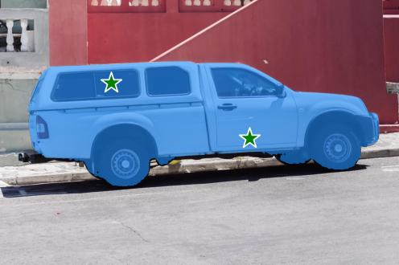
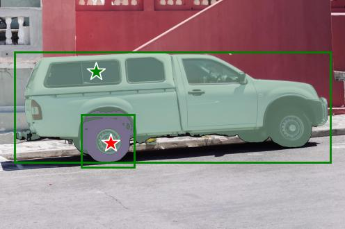

# OwLite Image Segmentation (Segment-anything) Example 
- Model: ViT-B

## Prerequisites

### Apply patch
```
cd segment-anything
patch -p1 < ../apply_owlite.patch
```

### Setup environment
1. create conda env and activate it
    ```
    conda create -n <env_name> python=3.10 -y
    conda activate <env_name>
    ```
    Conda environment can be created with Python versions between 3.10 and 3.12 by replacing ```3.10``` with ```3.11``` or ```3.12```. Compatible Python versions for each PyTorch version can be found in [PyTorch compatibility matrix](https://github.com/pytorch/pytorch/blob/main/RELEASE.md#release-compatibility-matrix).

2. install required packages
    ```
    pip install -e .
    ```
3. install OwLite package following the [installation guide](https://squeezebits.gitbook.io/owlite/user-guide/getting-started/install)

### Download checkpoint
Download checkpoint from the original [repo](https://dl.fbaipublicfiles.com/segment_anything/sam_vit_b_01ec64.pth)
```
wget https://dl.fbaipublicfiles.com/segment_anything/sam_vit_b_01ec64.pth
```

## How To Run

### Run baseline model
```
CUDA_VISIBLE_DEVICES=0 python test.py owlite --project <owlite_project_name> --baseline <owlite_baseline_name> 
```

### Run quantized model
1. Create an experiment and save the config on OwLite GUI
2. Run the code for OwLite PTQ. Any image datasets can be used for calibration
    ```
    CUDA_VISIBLE_DEVICES=0 python test.py owlite --project <owlite_project_name> --baseline <owlite_baseline_name> --experiment <owlite_experiment_name> --ptq --data-path <dataset_path_for_calibration>
    ```

## Results

<details>
<summary>ViT-B</summary>

### Quantization Configuration

- Apply OwLite Recommended Config with the following calibration method
  - PTQ calibration: MSE

### Latency Results
TensorRT Evaluation GPU: A6000

| Quantization    | Input Size        | GPU Latency (ms) | 
| --------------- |:-----------------:|:----------------:|
| FP16 TensorRT   | (1, 3, 1024, 1024) | 25.41             |
| OwLite INT8 PTQ | (1, 3, 1024, 1024) | 18.24             |
| INT8 TensorRT   | (1, 3, 1024, 1024) | 25.41             |

- The INT8 TensorRT engine was built by applying FP16 and INT8 flags using [Polygraphy](https://github.com/NVIDIA/TensorRT/tree/main/tools/Polygraphy). However, the results were the same as those of the FP16 TensorRT engine, as the attempt to build with INT8 failed, leading to fallback to FP16 for all operations. Further explained in [TRT Developer Guide](https://docs.nvidia.com/deeplearning/tensorrt/developer-guide).

### Qualitative Results

#### 1. Selecting a specifying object with point(s)

```
    python test.py --img-path notebooks/images/truck.jpg --task point --point-coords 500 375 1125 625 --point-labels 1 1 --output-path <path_to_save_result_image> owlite --project <owlite_project_name> --baseline <owlite_baseline_name> --experiment <owlite_experiment_name> --ptq --data-path <dataset_path_for_calibration>
```

| FP16        | OwLite INT8 | 
|:-----------------:|:----------------:|
|  | |


#### 2. Selecting specifying objects with box(es)

```
    python test.py --img-path notebooks/images/groceries.jpg --task bbox --bbox-coords 450 170 520 350 350 190 450 350 500 170 580 350 580 170 640 350 --output-path <path_to_save_result_image> owlite --project <owlite_project_name> --baseline <owlite_baseline_name> --experiment <owlite_experiment_name> --ptq --data-path <dataset_path_for_calibration>
````

| FP16        | OwLite INT8 | 
|:-----------------:|:----------------:|
|  | |

#### 3. Selecting specifying objects with point(s) and box(es)

```
    python test.py --img-path notebooks/images/truck.jpg --task point_bbox --bbox-coords 75 275 1725 850 425 600 700 875 --point-coords 500 375 575 750 --point-labels 1 0 --output-path <path_to_save_result_image> owlite --project <owlite_project_name> --baseline <owlite_baseline_name> --experiment <owlite_experiment_name> --ptq --data-path <dataset_path_for_calibration>
```

| FP16        | OwLite INT8 | 
|:-----------------:|:----------------:|
|  | |


</details>

## Reference
https://github.com/facebookresearch/segment-anything